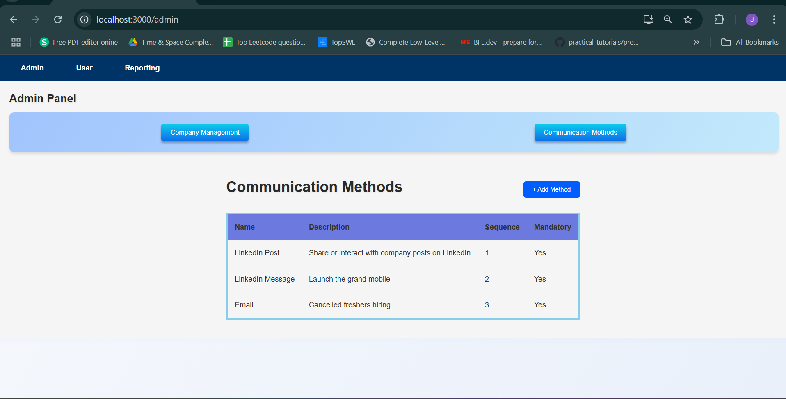
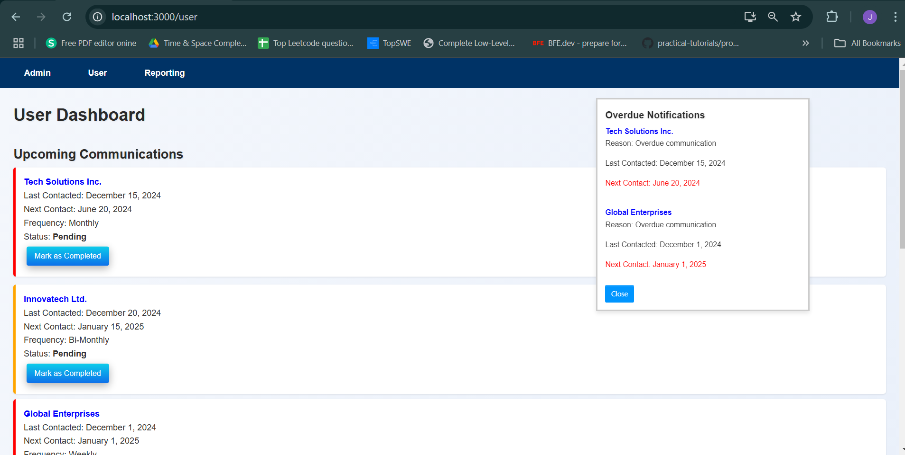

User Dashboard with Overdue Notifications and Calendar View
Project Overview
This project implements a User Dashboard that displays overdue communication notifications, a list of companies, and an interactive calendar. It includes features such as marking communications as completed, showing overdue or pending communications, and a detailed view of each company.

Key Features:
User Dashboard: Displays a list of companies with their communication details.
Overdue Notifications: Displays overdue communication tasks with a notification system.
Interactive Calendar: Allows users to manage communications in a calendar view.
Communication Details: Click on a company name to view additional details.
Project Setup
Follow the steps below to set up and run the project locally.

Prerequisites
Ensure you have the following installed:

Node.js (version 14.x or higher)
npm (Node Package Manager)
Steps to Set Up
Clone the repository:

bash
Copy code
git clone https://github.com/your-username/your-repo-name.git
Install dependencies:

Navigate to the project folder and install the required dependencies using npm:

bash
Copy code
cd your-repo-name
npm install
Run the development server:

Once the dependencies are installed, you can start the development server:

bash
Copy code
npm start
Open your browser and go to http://localhost:3000 to see the app in action.

Technologies Used
React: JavaScript library for building user interfaces.
React Hooks: useState, useEffect, useCallback for managing state and lifecycle methods.
Date-fns: A modern JavaScript date utility library for formatting dates.
CSS: Used for styling the components, with custom animations and transitions.

# User Dashboard with Overdue Notifications and Calendar View

## Admin Page

## User Page

